# Sistem Informasi Persuratan Sekolah

Aplikasi web untuk mengelola alur surat masuk dan keluar sebuah sekolah, mencakup proses upload surat, tanda tangan digital, revisi, hingga pengiriman surat ke pihak terkait via WhatsApp.

**Proyek:** Tugas Kelompok — Mata Kuliah MPTI (Manajemen Proyek Teknologi Informasi)
**Peran saya:** System Analyst
**Klien:** Sebuah sekolah (atas permintaan dinas terkait)

> ⚠️ **Catatan Kerahasiaan & Kepemilikan**
> Source code aplikasi ini merupakan hak milik pihak sekolah selaku klien dan tidak dapat dipublikasikan. Repositori ini berisi **dokumentasi, alur sistem, dan tampilan antarmuka** yang saya susun dan kembangkan bersama tim sebagai bukti proses kerja dan hasil akhir aplikasi.

---

## Peran Saya sebagai System Analyst

- Merancang **flowchart alur sistem** untuk tiap peran pengguna (Kepala Sekolah & Divisi Surat)
- Menyusun **dokumen kebutuhan (requirement)** aplikasi berdasarkan permintaan klien
- Membuat **buku panduan penggunaan** aplikasi secara lengkap untuk pengguna akhir
- Menjembatani kebutuhan pihak sekolah dengan tim developer selama proses pengembangan

---

## Alur Login & Registrasi

| Akses Website | Registrasi Akun |
|---|---|
| 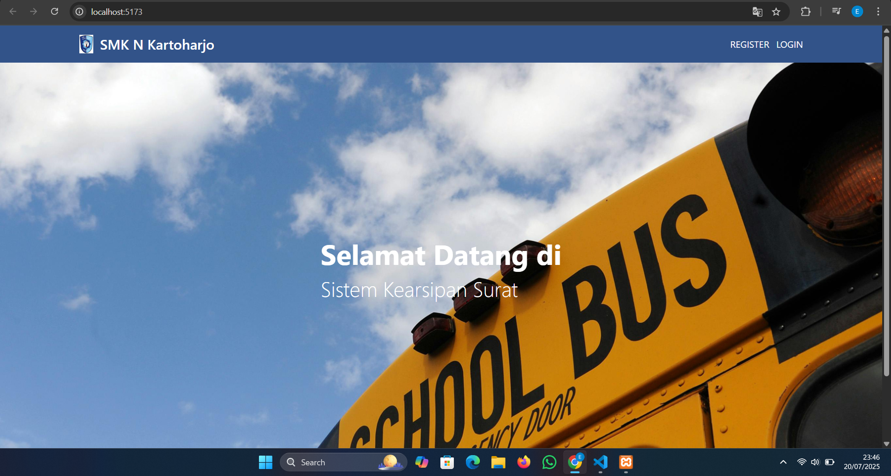 | 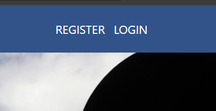 |

| Form Data Diri | Login |
|---|---|
| 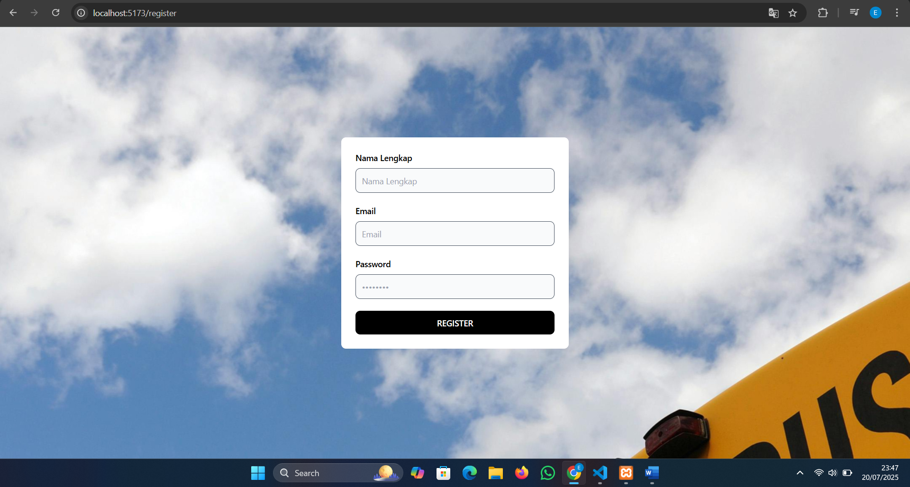 | 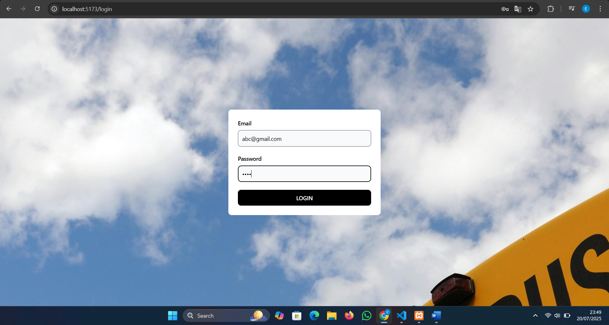 |

Setelah login, pengguna diarahkan ke tampilan yang berbeda sesuai peran/jabatan masing-masing.

---

## Alur Kepala Sekolah

Kepala Sekolah dapat meninjau, menandatangani secara digital, atau merevisi surat yang masuk.

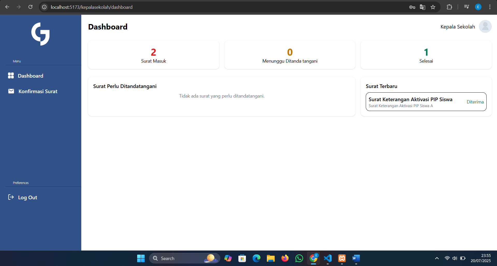
*Halaman utama menampilkan surat yang perlu ditandatangani, surat terbaru, dan jumlah surat masuk dalam 1 minggu terakhir.*

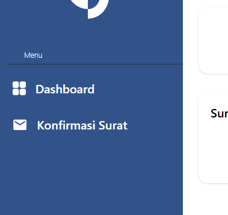
*Daftar surat yang menunggu tanda tangan.*

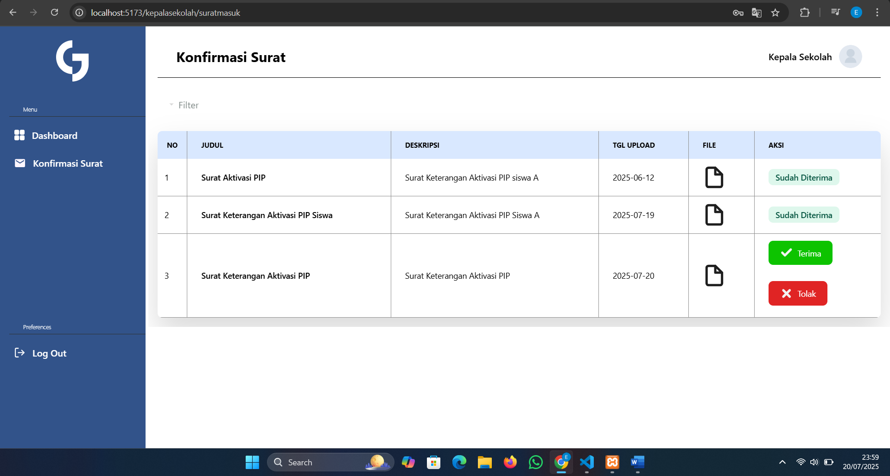

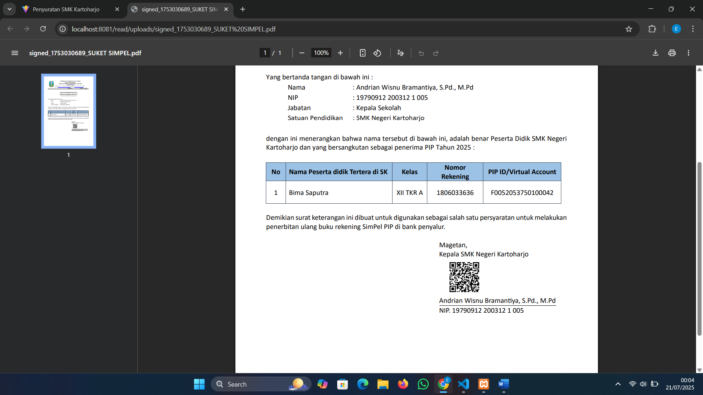
*Menekan tombol "Terima" akan otomatis membuat barcode tanda tangan digital pada surat.*

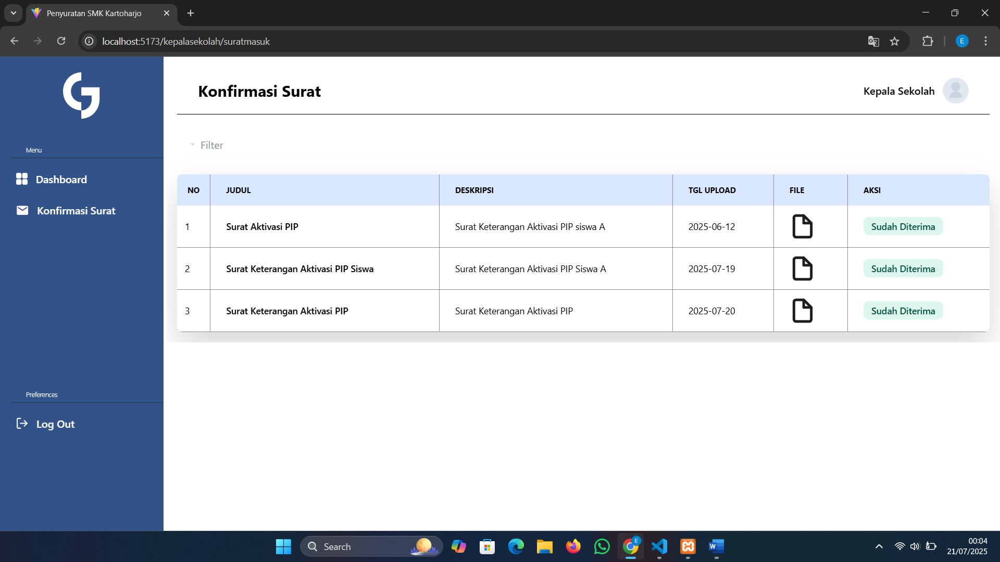
*Status surat otomatis berubah menjadi "sudah ditandatangani".*

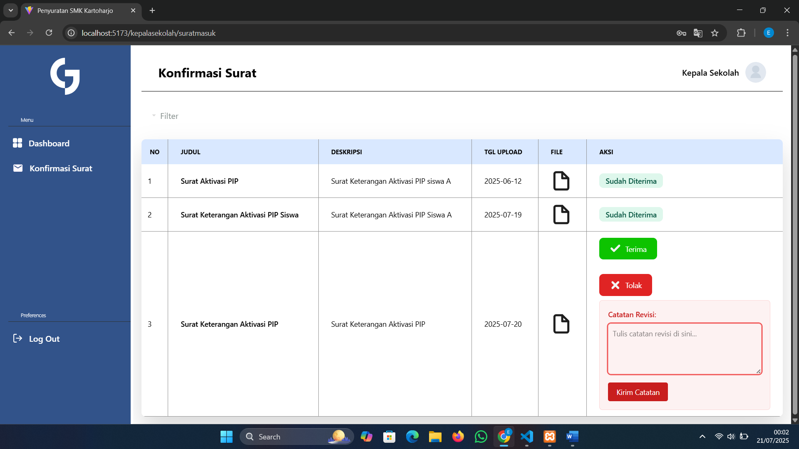
*Jika surat ditolak, sistem menampilkan form revisi yang otomatis terkirim ke Divisi Surat.*

---

## Alur Divisi Surat

Divisi Surat bertugas mengelola seluruh siklus dokumen: upload, edit, arsip, hingga pengiriman surat.

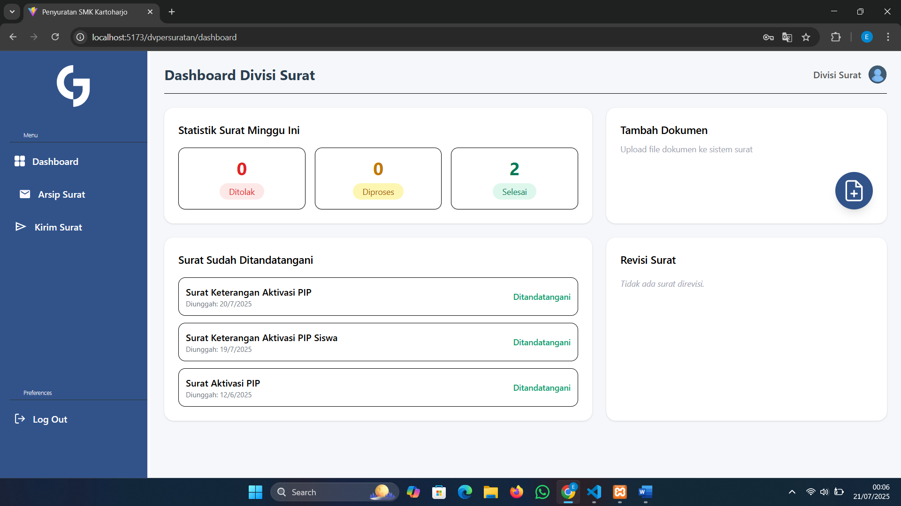
*Ringkasan proses persuratan minggu berjalan: surat ditandatangani, dokumen baru, dan surat direvisi.*

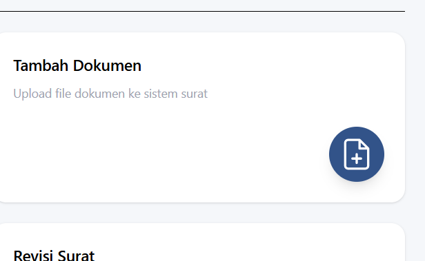

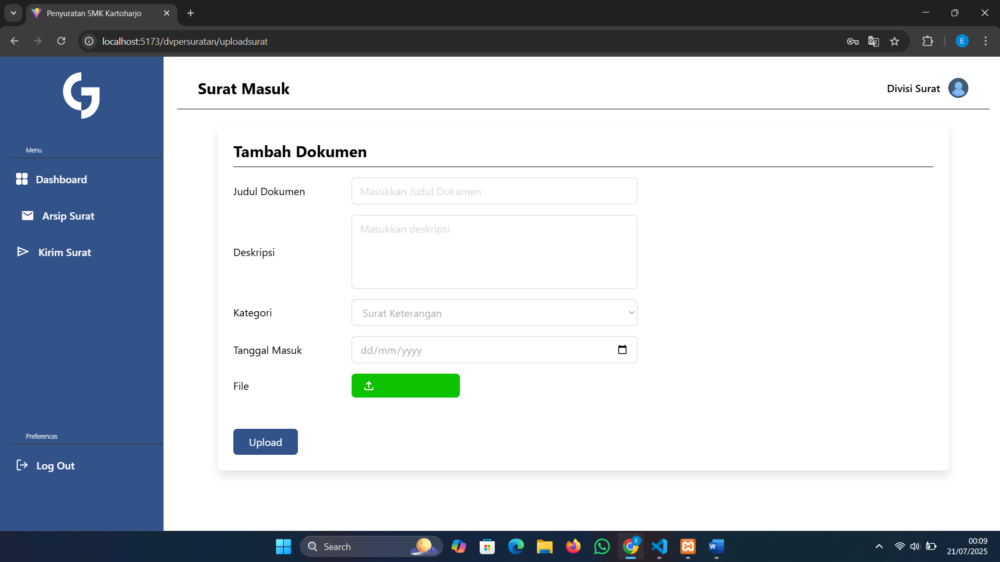
*Form pengisian data surat sebelum dikirim ke Kepala Sekolah untuk ditandatangani.*

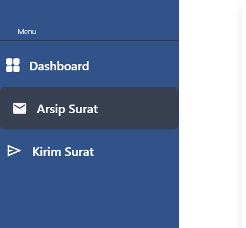

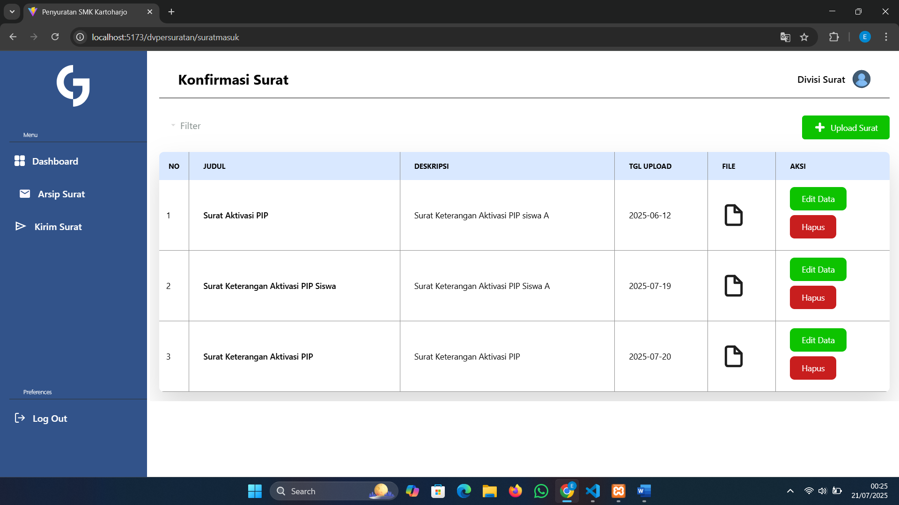
*Seluruh riwayat surat yang pernah diupload.*

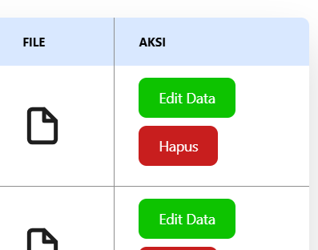

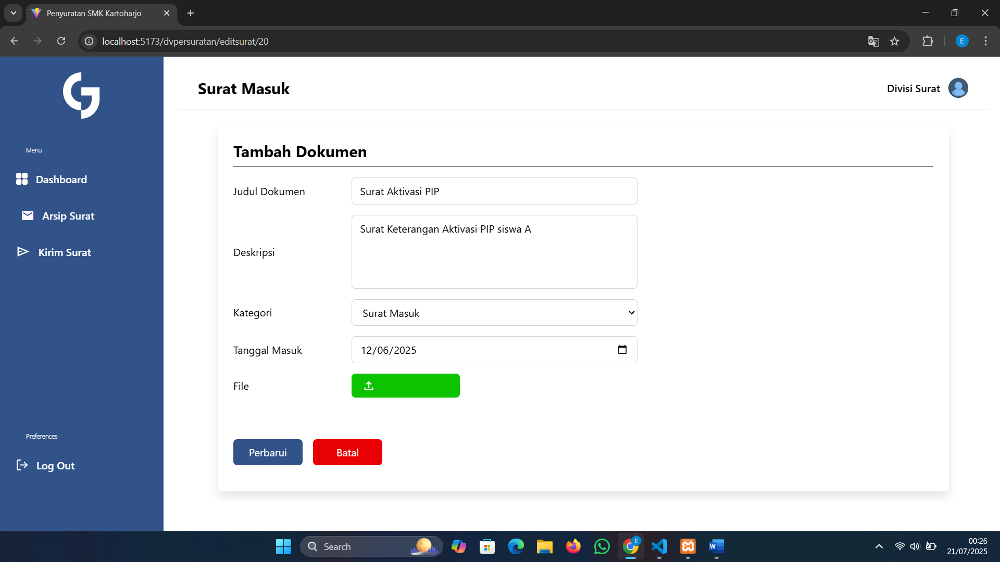
*Pembaruan data surat yang memerlukan revisi.*

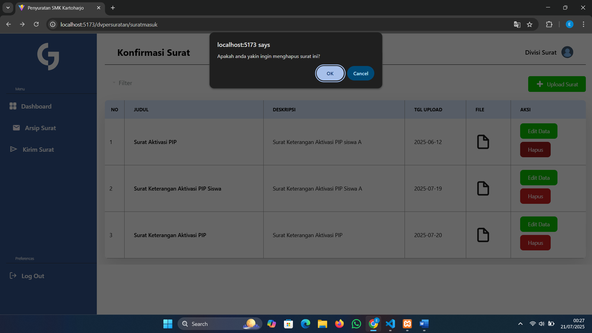
*Pop-up konfirmasi sebelum data surat dihapus permanen.*

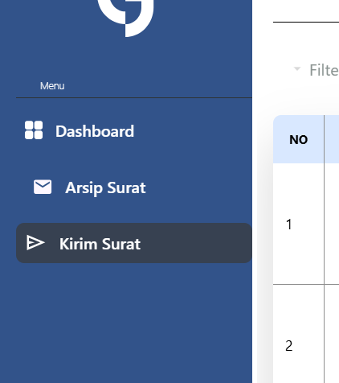

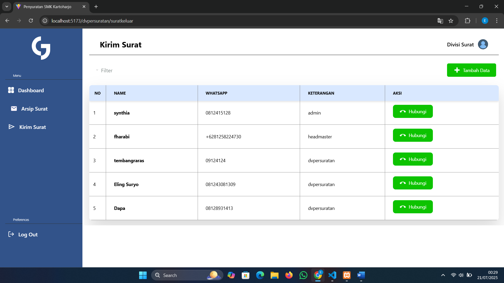
*Daftar nama dan nomor WhatsApp penerima surat.*

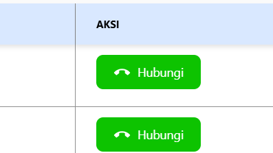

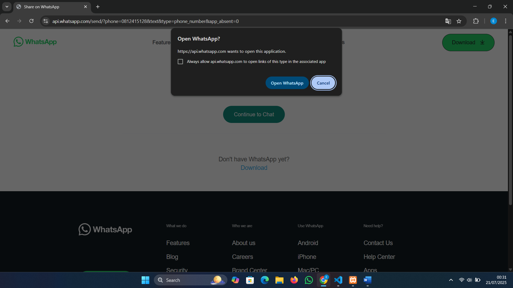
*Sistem otomatis mengarahkan ke WhatsApp untuk mengirimkan surat langsung ke pihak terkait.*

---

## Insight & Pembelajaran

Melalui proyek ini saya belajar menyusun alur sistem multi-role (Kepala Sekolah & Divisi Surat) yang saling terhubung, menerjemahkan kebutuhan klien non-teknis menjadi dokumen requirement dan flowchart yang bisa diimplementasikan tim developer, serta menyusun dokumentasi pengguna akhir yang mudah dipahami oleh staf sekolah yang awam teknologi.

---

## Kontak
Synthia Wulandari — [Synthiawln@gmail.com](mailto:Synthiawln@gmail.com) · [LinkedIn](https://linkedin.com/in/synthia-wln)
